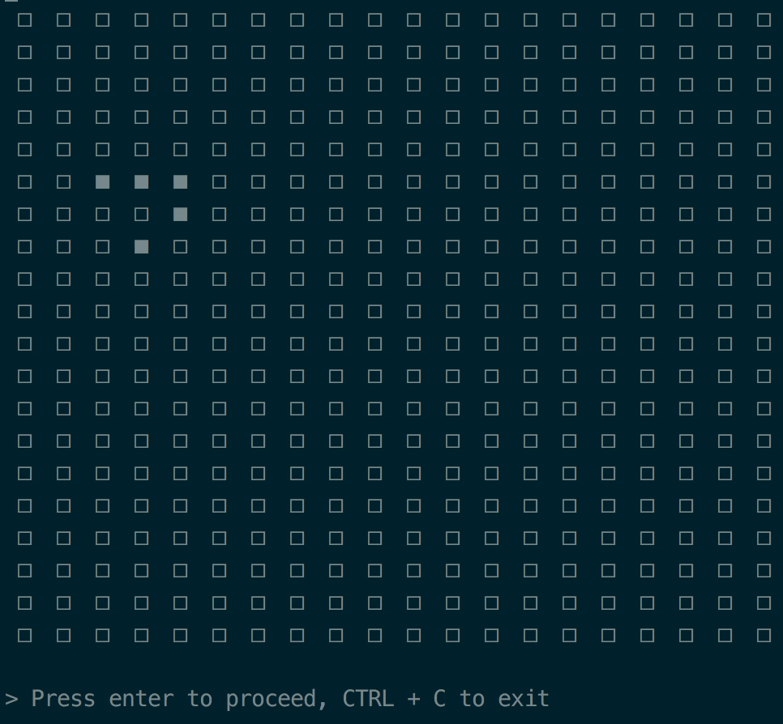

# Conway's Game of Life in Haskell

A 'Glider' in action:


## Build it:

```bash
cabal sandbox init
cabal install --only-dependencies
cabal build
```

## Run it:

```bash
./dist/build/haskell-game-of-life/haskell-game-of-life
```
